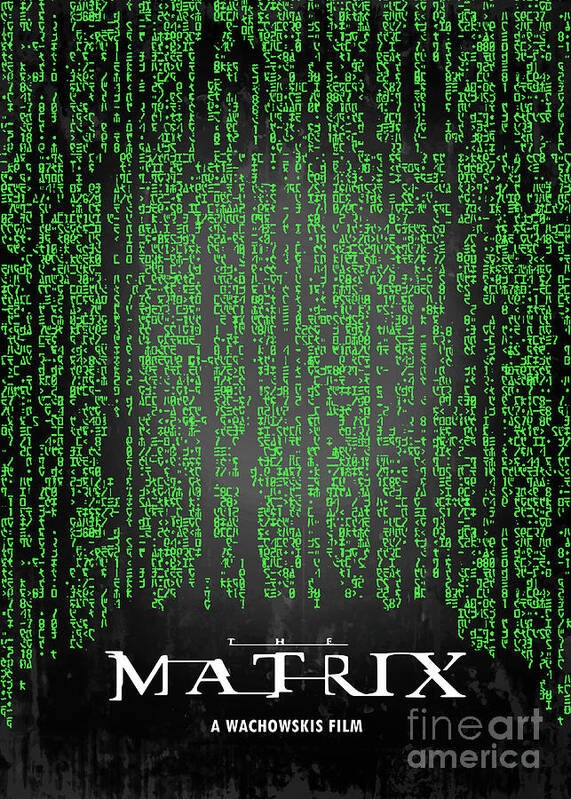
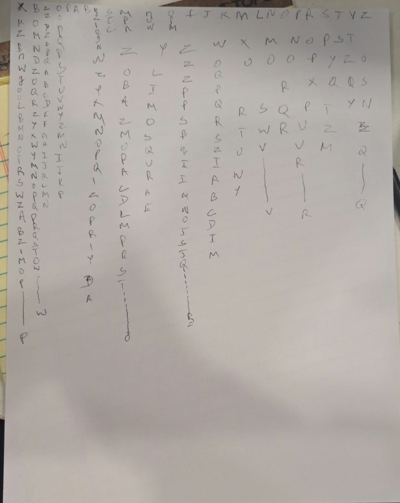

# Mid-Term Project: Matrix-Inspired Poster (Milestone 2)

## Progress Update
This week, I focused on the core functionality and interactivity of the project. I implemented the main components:
- Characters falling in randomized patterns.
- Interactive features including gravity control via mouse movement and color change on mouse click.
- Initial groundwork for adding unique effects and a visual twist to make the design more distinct.

---

## Project Structure

### 1. Scenes or Moments
The project primarily features one continuous scene but with interactive moments that alter its appearance:
1. **Title Display** - An initial static display of characters (e.g., "The Matrix") at the top.
2. **Falling Characters** - After a short delay, the title falls into a randomized animation pattern with character paths and interactivity.

### 2. Interactive Events
- **Mouse Movement** - Controls gravity to speed up or slow down the falling characters.
- **Mouse Click** - Triggers a temporary color change for a “hacking” effect.
- **(Optional) Keyboard Input** - Potential to add additional effects, such as toggling different patterns or resetting the scene.

---

### 3. Code Details

**Files and Classes:**
- **Files** - No external files required as of now.
- **Classes and Arrays**:
  - `fallingChars` array - Stores individual `FallingChar` objects for animation.
  - `FallingChar` class - Defines properties (position, speed, color) and behaviors (falling, resetting) for each character.

---

## Custom Functions

**Functions and Methods:**
1. **FallingChar Class**:
   - `constructor(x, y)` - Sets initial position and properties for each character.
   - `getRandomChar()` - Randomly selects a character (A-Z or 0-9) to enhance the digital effect.
   - `update()` - Manages falling motion, gravity, and path changes.
   - `display()` - Displays each character in the current color and position.
   - `changeColor()` - Changes color when called, e.g., on mouse click.

2. **Gravity Control (`mouseMoved`)** - Adjusts gravity according to `mouseX` position.

3. **Color Change (`mousePressed`)** - Triggers `changeColor()` on all characters when the mouse is pressed.

**Placeholder Functions**:
   - **Scene Transition Function** - (Planned) If more scenes are added, a function will manage transitions between them.

---

## Pseudo-Code (Logic Flow)

1. **Setup**:
   - Set up canvas size, text properties, and generate an initial set of falling characters.
   - Populate `fallingChars` with `FallingChar` instances at randomized positions.

2. **Draw Loop**:
   - Draw background with partial transparency to create a trail effect.
   - Display title if in initial display mode.
   - Begin falling animation after a short delay or trigger.
   - For each `FallingChar` in `fallingChars`:
     - Update position and apply gravity.
     - Display the character with current properties.
   - Apply gravity control based on `mouseMoved()`, and color change on `mousePressed()`.

3. **Interactions**:
   - **mouseMoved()** - Adjusts gravity for falling characters.
   - **mousePressed()** - Calls `changeColor()` to alter the color temporarily.

---

This milestone showcases the foundational code and logic to guide the final design and interactive effects. I’m exploring further ideas to make the design more unique while aligning with the feedback received.

# MileStone 1

## 1. What book, album or movie did you choose? What is it about?
I chose The Matrix, which is a science fiction movie exploring the concept of reality versus simulation. The movie follows a hacker named Neo as he discovers that the world in which he lives is merely a simulated reality created by machines to subdue humanity. The movie nails its cyberpunk aesthetics. Its visuals particularly feature the green falling code representing the simulated world. 

## 2. What aspect of the book will you include in your cover?
The Matrix poster I would like to make will focus on the most recognizable visual of the film: the green, falling digital code. This code symbolizes the deconstructed reality and the digital world in which the characters live. The poster will be designed with vertical streams of randomly changing green code falling from the top to the bottom. It will bring dynamic imagery to the poster and an impression of futurism while symbolizing the artificiality of the film's setting. 

## 3. Is it interactive? time-based? both?
The poster shall allow interactivity and a timeline. The falling-code shall always create an animation over time, creating a loop of the green digital streams. In this sense, interactivity shall be given or rendered through mouse events-mouse movement will control the gravity acceleration of the falling code, simulating the manipulation of time and perception, much akin to how that is done within the film's simulated reality. Mouse clicking shall temporarily change the color of the code as though the user were "hacking" the simulation. 

## 4. What ideas would you like to explore or experiment with?  
I would like to explore the random and flowing characteristics of animation and its relation to time and interaction. Specifically, I want to play around with:

- Varying speeds of the falling code in relation to the movement of the mouse.
- Introducing randomness into changing characters within the falling code to enhance the chaotic digital effect.
- Making the poster responsive, allowing immediate user interaction (like mouse movements or clicks) to directly manipulate the behavior of the animation and give users control over the dynamics of the poster.
- Making the background with an atmospheric trail effect through transparency, providing a cyberpunk feel to the poster while keeping the falling code visually present throughout the design. 

## 5. Are there aspects of your project that are related to any of the readings we’ve done?

You know how we have made reference to the interconnectedness of interactivity and real-time response in our discussions? In particular, this tie-in connects with other theory and practices we've learned about designing engaging responsive designs. For instance, the concept of interaction as a cycle-an input from the user (for example, a mouse move) leads the system to modify the behavior of the falling code-sharply reflects similar lessons that we have learned about creating engaging, responsive designs. Timely and design-sensitive move within this connectivity, especially in regard to changes that are time-based and continuous, and how they might affect the perception and experience of a viewer. 

## Movie Poster:  

## Movie Poster Sketch:  

