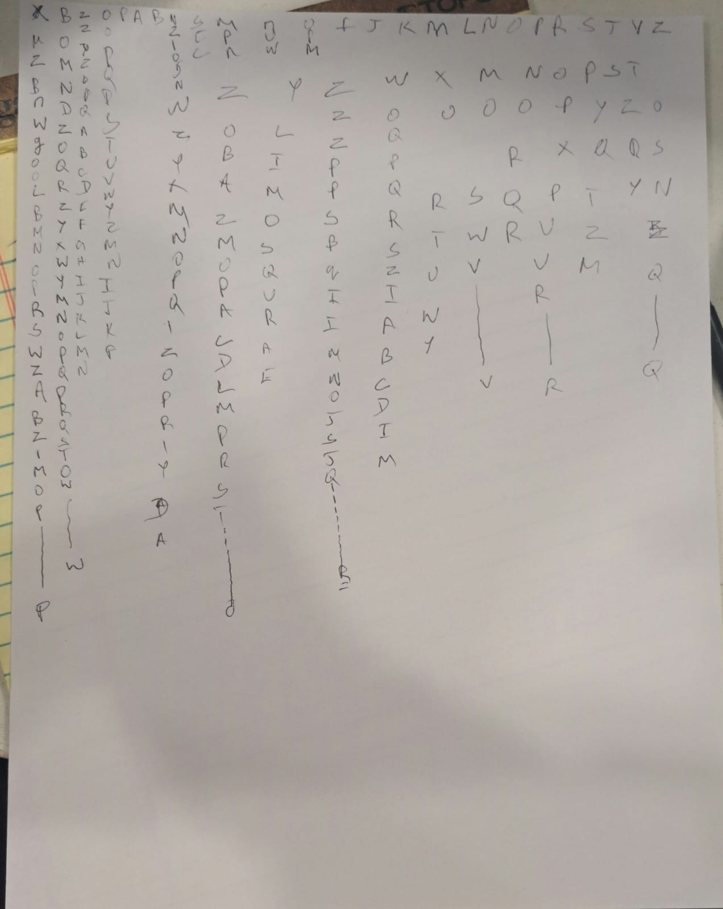

# Milestone 3

### What I’ve Done This Week
This week, I focused on enhancing the visual and interactive aspects of the falling characters project based on previous milestone feedback Key achievements include:

- **Implementing a Color Palette**: Implemented a consistent color palette featuring various shades of Matrix green, giving the characters a more consistent look rather than random colors.
- **Adding Pattern Formation**: Enabled characters to form a circular pattern when the mouse is clicked, also when we go from left to right the speed of the falling characters increases enhancing interactivity and user engagement.
- **Code Refinement**: Simplified the logic to update character positions, ensuring smooth transitions and a visually appealing display.
- **Testing and Optimization**: Conducted extensive testing to ensure all features worked as intended, adjusting parameters for optimal performance like in the formation of the circle it worked well when the random char was implemented using subset and with a 20characters.

### Description of Final Interactivity or Time-Based Logic
The final version of the project includes the following interactive features:
- **Falling Characters**: Characters fall from the top of the canvas, with their speed influenced by the horizontal position of the mouse, creating a gravity effect that users can control.
- **Circular Pattern Formation**: Upon clicking anywhere on the canvas, a selection of characters will form a circular pattern centered at the mouse location. The characters will smoothly transition to their new positions, displaying a cohesive and dynamic visual.
- **Color Dynamics**: While falling, characters are displayed in shades of green from the defined palette, providing a visual aesthetic reminiscent of the Matrix. When forming a circle, the characters will turn white, highlighting the new pattern.

### Images, Drawings, Sketches
Here are some visual representations of the project's key features:

1. **Falling Characters**: A screenshot of the canvas with characters falling in shades of green.
   

2. **Circular Pattern Formation**: A screenshot showing characters forming a circle upon mouse click.
   


# Milestone 2 

## What I’ve done this week:
In this milestone, I have continued developing my p5.js sketch for this project. I focused on creating a visually unique representation of the falling code, introducing random characters based on your feedback for my milestone 1 I'm trying to make it a raining effect for characters I've been working on it and allowing for interactive manipulation through mouse.

- Expanded on the existing falling code project by implementing a class for falling characters.
- Added interactivity using mouse movement and clicks to control the gravity and color of the characters.

## Description of the files, classes, objects or arrays I will use:
- **FallingChar Class**: This class defines the properties and behaviors of each falling character, including position, speed, color, and methods for updating and displaying itself.
- **Array of fallingChars**: An array to store multiple instances of `FallingChar` objects, which represent the falling characters on the screen.

## Description of any interactivity or time-based logic:
- **Gravity Control**: The gravity of the falling characters is adjusted based on the horizontal position of the mouse.
- **Color Change on Click**: Clicking the mouse changes the color of all falling characters to a random color.

## Description of functions I have written or will write:
- `setup()`: Initializes the canvas and creates falling character instances.
- `draw()`: Continuously updates and displays falling characters.
- `mouseMoved()`: Adjusts the gravity of falling characters based on mouse position.
- `mousePressed()`: Changes the color of falling characters on mouse click.
- `addVisualEffects()`: Placeholder function for implementing future visual effects.
- `keyPressed()`: Placeholder for keyboard interactions (e.g., changing background or pausing animation).

## Project Overview:
This project visualizes falling digital code inspired by *The Matrix*. The code symbolizes the deconstructed reality within the film, featuring interactive elements that respond to user input.

## Pseudo Code:-

```plaintext
// Initialize variables
Initialize fallingChars as an empty array
Set gravity to 0.1
Set startFalling to false (indicates when characters start falling)
Define character count (e.g., 100) for the falling characters

Function setup:
    Create canvas with window dimensions
    Set text size and alignment
    For each character in range (0 to character count):
        Create new instance of FallingChar with random x-position and initial y-position
        Add instance to fallingChars array

Function draw:
    Clear the background with a dark color and transparency for trail effect
    If startFalling is false:
        Display the title text in the center of the canvas
        If frameCount exceeds threshold (e.g., 200):
            Set startFalling to true (characters will start falling)
    Else:
        For each character in fallingChars:
            Update character position based on gravity
            Display character on canvas

Function mouseMoved:
    Map mouseX position to gravity value (control speed of falling characters)

Function mousePressed:
    For each character in fallingChars:
        Change the color of the character randomly

Class FallingChar:
    Constructor with parameters x, y:
        Set initial position (x, y)
        Generate a random character
        Set random speed for falling
        Set initial color to green

    Function getRandomChar:
        Return a random character from the specified set (e.g., A-Z, 0-9)

    Function update:
        Apply gravity to the y-position
        If character goes off the screen:
            Reset position to random x and y (above the canvas)
            Generate a new random character

    Function display:
        Set fill color for the character
        Draw character at its position

    Function changeColor:
        Set character's color to a random color

// Main execution flow
Call setup to initialize the project
Call draw in a loop to continuously update and render the falling characters
```

-------------------------------------------------
# Milestone 1

## 1. What book, album or movie did you choose? What is it about?
I chose The Matrix, which is a science fiction movie exploring the concept of reality versus simulation. The movie follows a hacker named Neo as he discovers that the world in which he lives is merely a simulated reality created by machines to subdue humanity. The movie nails its cyberpunk aesthetics. Its visuals particularly feature the green falling code representing the simulated world. 

## 2. What aspect of the book will you include in your cover?
The Matrix poster I would like to make will focus on the most recognizable visual of the film: the green, falling digital code. This code symbolizes the deconstructed reality and the digital world in which the characters live. The poster will be designed with vertical streams of randomly changing green code falling from the top to the bottom. It will bring dynamic imagery to the poster and an impression of futurism while symbolizing the artificiality of the film's setting. 

## 3. Is it interactive? time-based? both?
The poster shall allow interactivity and a timeline. The falling-code shall always create an animation over time, creating a loop of the green digital streams. In this sense, interactivity shall be given or rendered through mouse events-mouse movement will control the gravity acceleration of the falling code, simulating the manipulation of time and perception, much akin to how that is done within the film's simulated reality. Mouse clicking shall temporarily change the color of the code as though the user were "hacking" the simulation. 

## 4. What ideas would you like to explore or experiment with?  
I would like to explore the random and flowing characteristics of animation and its relation to time and interaction. Specifically, I want to play around with:

- Varying speeds of the falling code in relation to the movement of the mouse.
- Introducing randomness into changing characters within the falling code to enhance the chaotic digital effect.
- Making the poster responsive, allowing immediate user interaction (like mouse movements or clicks) to directly manipulate the behavior of the animation and give users control over the dynamics of the poster.
- Making the background with an atmospheric trail effect through transparency, providing a cyberpunk feel to the poster while keeping the falling code visually present throughout the design. 

## 5. Are there aspects of your project that are related to any of the readings we’ve done?

You know how we have made reference to the interconnectedness of interactivity and real-time response in our discussions? In particular, this tie-in connects with other theory and practices we've learned about designing engaging responsive designs. For instance, the concept of interaction as a cycle-an input from the user (for example, a mouse move) leads the system to modify the behavior of the falling code-sharply reflects similar lessons that we have learned about creating engaging, responsive designs. Timely and design-sensitive move within this connectivity, especially in regard to changes that are time-based and continuous, and how they might affect the perception and experience of a viewer. 


## Movie Poster:  


## Movie Poster Sketch:  

